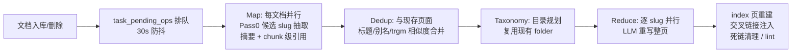
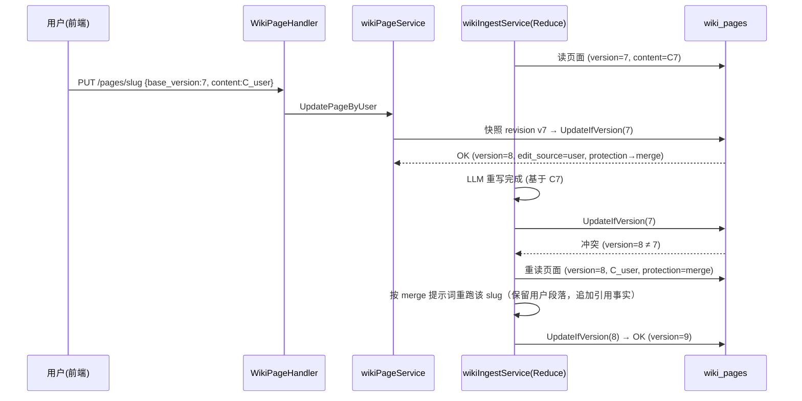

# Wiki 开放用户编辑 — 设计文档

> 基线版本：v0.6.3（tag `v0.6.3`，commit `974ca359`）
> 分支：`claude/wiki-user-editing-design-gocp14`
> 状态：设计评审稿（未包含实现代码）

---

## 1. 背景与目标

WeKnora 的 Wiki 功能会在文档入库后，通过 LLM 流水线自动生成一套互相链接的
Markdown 页面（summary / entity / concept / synthesis / comparison），形成"持续
复利的知识资产"。当前（v0.6.3）Wiki 页面的**内容**对普通用户是只读的：页面正文
只能由 ingest 流水线和 Agent 的 `wiki_write_page` 工具写入，用户在前端只能浏览、
搜索、整理目录（移动页面 / 增删文件夹）。

本设计要回答四个问题：

1. **要把 Wiki 开放给用户编辑，需要修改哪些地方？**
2. **能不能跟现在的知识构建（wiki ingest 流水线）兼容？**
3. **用户修改了 Wiki 之后，对后续继续编译（ingest / retract / 链接维护 / 检索问答）有什么影响？**
4. **开放之后有哪些优点和弊端？**

---

## 2. 现状分析（v0.6.3 代码事实）

在设计前先把现状钉死，以下均为对 v0.6.3 代码的实际调研结论。

### 2.1 数据模型

| 表 | 说明 | 关键字段 |
|---|---|---|
| `wiki_pages` | 页面本体 | `slug`（KB 内唯一）、`content`、`summary`、`page_type`、`status`、`source_refs`（来源文档）、`chunk_refs`（引用的 chunk）、`in_links`/`out_links`、`folder_id`、**`version`** |
| `wiki_folders` | 目录树（邻接表） | `parent_id`、`path`、`depth` |
| `wiki_page_issues` | 页面问题（lint/Agent 上报） | `issue_type`、`status` |
| `wiki_log_entries` | 操作流水（ingest/retract…） | `action`、`pages_affected` |

关键点（`internal/types/wiki_page.go`）：

- **`version` 字段已经是"真实编辑信号"**：只有 title/content/summary/page_type/status
  发生实际变化时才 +1，纯簿记写入（链接维护、同内容重灌）不递增
  （`wiki_page.go` service 层 `UpdatePage` 的注释和实现明确了这一契约）。
- **`folder_id` 上已经存在"人工优先"先例**：ingest 的目录规划只对
  `FolderID == ""` 的页面生效，注释原文 *"user-moved pages keep their placement
  (manual edits are authoritative)"*（`wiki_ingest_batch.go:1641-1650`）。
  这说明"用户操作优先于机器"在架构上已被接受，只是尚未推广到正文。
- **没有版本历史表**：`version` 只是一个 int，历史内容不保留，无法回滚/diff。

### 2.2 知识构建（wiki ingest）流水线

`internal/application/service/wiki_ingest*.go`，基于 asynq 异步任务 + Redis 锁
（`wiki:active:<kbID>`，60s TTL + 20s 续期），每批最多 5 个文档（可配），流程：



**Reduce 是与用户编辑冲突的核心环节**（`wiki_ingest_batch.go:1560-1664`）：

1. 读出现有页面（含 `content`）；
2. 把现有正文作为 `ExistingContent`、新文档引用块作为 `NewContent`、被删文档作
   为 `DeletedContent`，喂给 `WikiPageModifyPrompt`；
3. LLM **输出整页新正文**，直接替换 `page.Content`，走 `UpdatePage` 落库。

`WikiPageModifyPrompt`（`internal/agent/prompts_wiki.go:318` 起）的关键规则：

- 必须保留现有行内 chunk 引用（`[c003]` 形式）；
- 新增事实必须带引用；
- *"Preserve existing information that is still valid and still about {{Title}}"*；
- retract 时移除"**仅**来源于被删文档、且不在剩余来源/新信息中"的内容。

**结论**：ingest 是"LLM 全文重写"而非"结构化增量补丁"。已有正文会被送进
LLM 再吐出来，能不能原样保住用户的手写文字，只有提示词软约束，**没有硬保证**。

另外 `UpdatePage`（service 层）**没有乐观锁**：不比对 `version`，谁后写谁赢。
ingest 批处理耗时可达分钟级（LLM 调用），期间用户若编辑同一页面，
批处理落库时会把用户编辑**无感知地整页覆盖**（经典 lost update）。

### 2.3 编辑能力现状（重要：后端其实已经具备大部分 API）

| 能力 | 后端 API | 前端 UI | 权限门 |
|---|---|---|---|
| 页面读取 / 列表 / 搜索 / 图谱 / 索引 | ✅ | ✅ WikiBrowser | Viewer+ |
| **页面创建** `POST /wiki/pages` | ✅ 已存在 | ❌ 无 UI | OwnedWikiKBOrAdmin |
| **页面更新** `PUT /wiki/pages/*slug` | ✅ 已存在 | ❌ 无 UI（`updateWikiPage` 已在 `frontend/src/api/wiki/index.ts` 定义但零调用） | OwnedWikiKBOrAdmin |
| **页面删除** `DELETE /wiki/pages/*slug` | ✅ 已存在 | ❌ 无 UI | OwnedWikiKBOrAdmin |
| 文件夹增删改 / 页面移动 | ✅ | ✅ WikiFolderActions | OwnedWikiKBOrAdmin |
| Agent 会话内写页 | ✅ `wiki_write_page` 工具（**整页覆盖**语义） | ✅ WikiEditResult 卡片 | 随会话 |
| rebuild-links / auto-fix | ✅ | 部分 | OwnedWikiKBOrAdmin |

权限模型（`internal/router/rbac.go`、`router.go:1759-1801`）：
读 = Viewer+；写 = **KB 属主（creator）或租户 Admin+**（`OwnedWikiKBOrAdmin`，
沿 `:kb_id` 一跳查 KB.CreatorID）。也就是说"开放编辑"当前卡在两处：
**①前端没有编辑 UI；②写权限只到 KB 属主/管理员，普通成员（Contributor/Viewer）无法编辑**。

### 2.4 Wiki 内容如何参与问答/检索

- Agent 问答通过 `wiki_read_page` / `wiki_search` 工具**直接读 `wiki_pages` 表**
  （`internal/agent/tools/wiki_tools.go`）——**任何落库的编辑立刻对问答生效**，
  没有向量重建延迟。
- 检索管线预留了 `ChunkTypeWikiPage`（`internal/types/chunk.go:38`）并有
  `wiki_boost` 插件把 wiki chunk 得分 ×1.3（`chat_pipeline/wiki_boost.go`），
  `DeletePage` 也会清理 `"wp-"+page.ID` 的同步 chunk；但**当前代码中没有找到
  wiki page → chunk 的生产端**（只有消费端和删除端）。即向量检索链路对 wiki
  是"半接入"状态——这是开放编辑后需要一并补齐/明确的点。

---

## 3. 需求定义：什么叫"开放给用户编辑"

按开放半径分三级，本设计以 **L2 为目标交付**，L3 列为远期：

| 级别 | 谁能编辑 | 说明 |
|---|---|---|
| L1（现状） | KB 属主 / 租户 Admin | API 已支持，仅缺 UI |
| **L2（本设计目标）** | 租户内成员，按 KB 级策略开放（owner_only / members / admins） | 需要权限策略 + 编辑 UI + 冲突与保护机制 |
| L3（远期） | 草稿-审核工作流、匿名/跨租户协作、评论区 | 需要审批流与更重的治理 |

---

## 4. 需要修改的地方（详细清单）

### 4.1 数据库（1 个新迁移，建议编号 `000064_wiki_user_editing`）

```sql
-- wiki_pages 增列
ALTER TABLE wiki_pages ADD COLUMN edit_source   VARCHAR(16) NOT NULL DEFAULT 'ingest';
       -- 'ingest' | 'agent' | 'user'：最后一次内容写入的来源
ALTER TABLE wiki_pages ADD COLUMN edited_by     VARCHAR(36) NOT NULL DEFAULT '';
       -- 最后编辑者 user_id（来源为 user/agent 时有值）
ALTER TABLE wiki_pages ADD COLUMN protection    VARCHAR(16) NOT NULL DEFAULT 'auto';
       -- 'auto'   ：机器可整页重写（现状行为）
       -- 'merge'  ：机器只能追加合并，须保留用户段落（默认，用户编辑过后自动升级）
       -- 'locked' ：机器完全不碰正文，只维护链接/元数据

-- 版本历史（回滚 / diff / 审计的基础）
CREATE TABLE wiki_page_revisions (
    id           VARCHAR(36) PRIMARY KEY,
    tenant_id    BIGINT       NOT NULL,
    kb_id        VARCHAR(36)  NOT NULL,
    page_id      VARCHAR(36)  NOT NULL,
    version      INT          NOT NULL,      -- 对应 wiki_pages.version 的快照
    title        VARCHAR(512) NOT NULL,
    content      TEXT         NOT NULL,
    summary      TEXT         NOT NULL,
    edit_source  VARCHAR(16)  NOT NULL,
    edited_by    VARCHAR(36)  NOT NULL DEFAULT '',
    change_note  VARCHAR(512) NOT NULL DEFAULT '',
    created_at   TIMESTAMP    NOT NULL,
    UNIQUE (page_id, version)
);
CREATE INDEX idx_wiki_rev_page ON wiki_page_revisions (page_id, version DESC);

-- KB 级编辑策略：knowledge_bases 的 wiki 配置 JSON（WikiConfig）加字段即可，无需 DDL
--   wiki_config.edit_policy: 'owner_only'(默认，兼容现状) | 'members' | 'admins'
--   wiki_config.revision_keep: 保留最近 N 个版本（默认 50，0=不限）
```

要点：

- `protection` 默认 `'auto'` ⇒ **存量数据行为完全不变**（迁移零风险）。
- 历史表按 `revision_keep` 截断，避免 4 万页 KB 的存储爆炸；`summary`/`title`
  一并快照，回滚才完整。
- SQLite / MySQL / ParadeDB 三套迁移目录（`migrations/{sqlite,mysql,paradedb}`
  与 `versioned/`）需同步添加，遵循仓库现有迁移惯例。

### 4.2 类型层（`internal/types/wiki_page.go`）

- `WikiPage` 增加 `EditSource`、`EditedBy`、`Protection` 字段与常量：
  `WikiEditSourceIngest/Agent/User`、`WikiProtectionAuto/Merge/Locked`。
- 新增 `WikiPageRevision` 类型 + `TableName()`。
- `WikiConfig` 增加 `EditPolicy string`、`RevisionKeep int`。
- 新增请求/响应 DTO：
  - `WikiPageUpdateRequest{ Title, Content, Summary, PageType, Status, Aliases, ChangeNote string; BaseVersion int }`
    —— **不再直接绑定整个 `WikiPage` 结构**（现状 handler 直接
    `ShouldBindJSON(&types.WikiPage)`，用户可以伪造 `source_refs`/`chunk_refs`/
    `in_links` 等机器簿记字段，开放编辑后必须收窄为白名单 DTO）。
  - `WikiPageRevisionListResponse`。

### 4.3 仓储层（`internal/application/repository/wiki_page.go`）

- `Update` / `UpdateMeta` 增加对新列的持久化。
- 新增 `wiki_page_revision.go`：`Create / ListByPage / GetByPageVersion / TrimOld`。
- `Update` 增加**乐观锁变体**：`UpdateIfVersion(ctx, page, baseVersion)`，
  `WHERE version = ?` 条件更新，返回 `ErrWikiPageVersionConflict`。

### 4.4 服务层（`internal/application/service/wiki_page.go` + `wiki_ingest_batch.go`）

**wikiPageService：**

1. `UpdatePage` 拆出面向用户的入口 `UpdatePageByUser(ctx, req)`：
   - 校验 `BaseVersion`，不匹配返回版本冲突（HTTP 409，前端提示"页面已被
     ingest/他人更新，请刷新合并"）；
   - 写入前把**旧内容快照进 `wiki_page_revisions`**；
   - 落库时设 `edit_source='user'`、`edited_by=<uid>`；
   - `protection=='auto'` 时自动升级为 `'merge'`（用户动过的页面默认受保护）；
   - 复用现有 out-link 解析 / in-link 维护 / 目录缓存重算逻辑（已齐备，不动）；
   - 内容安全：长度上限（建议 512 KB）、slug 规范校验复用 `normalizeSlug`，
     前端渲染继续走现有 markdown 渲染器的 XSS 过滤（wiki 正文本来就渲染
     LLM 生成的 markdown，渲染面无新增攻击类型，但需确认 `v-html` 路径有
     sanitize——WikiBrowser 现状渲染管线沿用即可）。
2. `CreatePageByUser` / `DeletePageByUser`：同样打 `edit_source`、写 revision
   （删除前快照，软删已有，恢复 = 恢复行 + 重建链接）。
3. 新增 `ListRevisions` / `RollbackToRevision`（回滚 = 以历史内容走一次
   `UpdatePageByUser`，产生新版本而非改写历史）。
4. Agent 的 `wiki_write_page` 工具改走同一入口，`edit_source='agent'`；
   **Agent 写 `locked` 页面时拒绝并把原因返回给模型**（工具报错文案即可）。

**wikiIngestService（Reduce 阶段，`materializeSlug` 附近）：**

按 `protection` 三态分流：

```go
switch page.Protection {
case types.WikiProtectionLocked:
    // 不重写正文。仅：append source_refs / chunk_refs、
    // 更新链接簿记、必要时在 wiki_page_issues 里报一条
    // "locked 页面有新来源信息待人工合并" 的 issue。
case types.WikiProtectionMerge:
    // 走新提示词 WikiPageMergePrompt：
    //  - ExistingContent 标记为 "user-maintained, MUST be preserved verbatim
    //    except where factually contradicted by cited chunks"
    //  - 产出限定为"在现有文档结构上追加/修订带引用的事实段落"
    //  - retract 时只允许删除带 [cNNN] 引用且引用链全部失效的句子
case types.WikiProtectionAuto: // 现状行为，不变
}
```

落库改用 `UpdateIfVersion`（以 Reduce 开始时读到的 version 为基线）：
- 冲突（用户在批处理期间编辑过）⇒ **重读页面重跑该 slug 的 Reduce 一次**；
  再冲突则放弃本轮、把 op 留在 `task_pending_ops` 等下一批（机制现成）。
  这样彻底消灭 2.2 节的 lost update 竞态，且用户永远赢。
- ingest 写库时 `edit_source='ingest'`，**不写 revision**（机器版本太多，
  只在覆盖"用户版本"前快照一次：若当前行 `edit_source=='user'`，先快照）。

**dedup / taxonomy / 链接维护：**

- 用户新建页面天然进入 dedup 候选集（dedup 对比的就是现存页面的
  title/aliases），未来 ingest 提取到同名实体会合并到用户页面而不是另开新页
  —— **无需改动，天然兼容**；
- `injectCrossLinks` / `cleanDeadLinks` / `UpdateAutoLinkedContent`（不 bump
  version 的机器链接装饰）对 `merge` 页面保留，对 `locked` 页面**跳过正文改写、
  只维护 in/out_links 元数据**；
- 用户删除页面：复用现有死链清理（`cleanDeadLinks`）+ `DeletePage` 已有的
  in-link 摘除逻辑，另外向 `wiki_log_entries` 记 `user_delete`。

### 4.5 权限层（`internal/router/rbac.go` + `router.go`）

- 新守卫 `WikiEditAllowed()`：先查 KB 的 `wiki_config.edit_policy`——
  - `owner_only`（默认）：等价现有 `OwnedWikiKBOrAdmin()`，**升级后行为不变**；
  - `members`：租户内 Contributor+ 即可写（仍要求通过现有 KB 访问守卫，
    即own/org-shared/agent-shared 可见的 KB）；
  - `admins`：仅租户 Admin+。
- 替换以下路由的写守卫：`POST/PUT/DELETE /wiki/pages*`、`PUT /wiki/move-page`、
  folder 三个写口；`rebuild-links`、`auto-fix`、issue 状态维持
  `OwnedWikiKBOrAdmin`（运维语义，不属于"编辑内容"）。
- 新路由：
  - `GET  /wiki/pages/*slug/revisions`（Viewer+）
  - `POST /wiki/pages/*slug/rollback` `{version}`（WikiEditAllowed）
- 频控：对写口挂现有 ratelimit 中间件（防脚本刷写）。

### 4.6 Handler 层（`internal/handler/wiki_page.go`）

- `UpdatePage`/`CreatePage` 改绑白名单 DTO（见 4.2），从 auth 上下文取
  `user_id` 注入 `edited_by`；409 映射 `ErrWikiPageVersionConflict`。
- 新增 `ListRevisions` / `Rollback` handler；swagger 注释同步。

### 4.7 前端（`frontend/src/views/knowledge/wiki/` + `api/wiki/index.ts`）

1. **编辑模式**：WikiBrowser 阅读器加"编辑"按钮（按权限显隐，权限信息可由
   `GET /wiki/pages` 响应头或 KB 详情里的 `wiki_edit_allowed` 布尔下发）：
   - Markdown 编辑器（建议复用项目已有 markdown 渲染栈做双栏预览；
     `[[slug|标题]]` 输入时用 `searchWikiPages` 做自动补全）；
   - 提交时带 `base_version` + `change_note`；409 时弹"内容已变化"对话框，
     支持"查看最新版 / 用我的覆盖（重新基于新版本提交）"；
   - 页面顶部显示 `protection` 状态与切换器（编辑者可在 merge/locked 间切换）。
2. **新建/删除页面**：目录树与阅读器工具栏入口；新建时选 page_type、目录、
   自动 slugify（复用后端 `slugify` 规则，前端仅做预览）。
3. **历史版本**：版本列表抽屉 + diff 视图（前端 diff 库做行级对比）+ 回滚按钮。
4. **状态提示**：`getWikiStats().is_active === true`（ingest 正在跑）时，编辑器
   顶部黄条提示"知识构建进行中，保存可能触发合并"，不阻塞保存（后端乐观锁
   已兜底）。
5. **KB 设置**：`KBIndexingStrategy.vue`/wiki 设置区加 `edit_policy` 下拉。
6. i18n：`knowledgeEditor.wikiBrowser.*` 补充中英词条。

### 4.8 检索同步（补齐半接入的 chunk 链路，可作为 P2）

现状 wiki 页面靠 Agent 工具直读 DB 参与问答，编辑即时生效，**P0/P1 不需要
任何检索改动**。若后续要让 wiki 页面进入向量/全文检索（`ChunkTypeWikiPage`
的既定设计），需补：

- 页面写入（任何来源）后同步 upsert `"wp-"+page.ID` chunk 并触发 embedding；
- 失败重试走既有任务队列；`DeletePage` 的清理端已存在。

---

## 5. 与现有知识构建的兼容性结论

**能兼容，且架构阻力很小。** 依据：

1. **写入口统一**：ingest、Agent 工具、REST API 最终都收敛到
   `wikiPageService.UpdatePage/CreatePage`，在这一层加保护策略和乐观锁，
   三条写路径同时受控，不需要动 Map/Dedup/Taxonomy 阶段。
2. **"人工优先"已有先例**：`FolderID` 的人工放置已被 ingest 尊重；`version`
   字段的"真实编辑信号"契约就是为这类场景预留的。本设计只是把同样的原则
   从"目录位置"推广到"正文内容"。
3. **默认值即现状**：`protection='auto'` + `edit_policy='owner_only'` 时，
  系统行为与 v0.6.3 完全一致；所有新行为都是显式 opt-in。
4. **失败路径复用**：Reduce 冲突重试可直接复用 `task_pending_ops` 重排队
   机制；locked 页面的"待合并"提醒复用 `wiki_page_issues`。

**不兼容点（必须改才能开放，也是本设计的核心改动）**：

- `UpdatePage` 无乐观锁 ⇒ ingest 与用户互相覆盖（改动 4.3/4.4）；
- Reduce 的 LLM 全文重写对用户文本无硬保护（改动 4.4 的 protection 三态）；
- handler 直接绑定整个 `WikiPage` 结构，开放后是越权写簿记字段的口子（改动 4.2/4.6）；
- 无版本历史，误编辑/恶意编辑不可恢复（改动 4.1/4.3）。

---

## 6. 用户修改 Wiki 后，对后续知识编译的影响

按事件逐条分析（括号内为本设计的应对）：

| 后续事件 | 对用户编辑的影响 | 设计应对 |
|---|---|---|
| **新文档 ingest 命中同一 slug** | 现状：用户正文作为 `ExistingContent` 被 LLM 整页重写，提示词只承诺"保留仍然有效的信息"，用户措辞可能被改写、无引用的手写段落可能被当噪音丢弃 | `merge`：新提示词强制逐字保留用户段落，只追加带引用事实；`locked`：不碰正文，新信息进 issue 待人工合并 |
| **来源文档被删除（retract）** | 现状：LLM 移除"仅来源于被删文档"的内容。用户手写内容不带 `[cNNN]` 引用，多数情况会被保留，但存在误删风险；反向风险：用户手抄了被删文档的内容，则**不会**被撤回，形成"脱源知识" | `merge/locked` 下 retract 只能删除带失效引用的句子；脱源风险记入 lint 规则（提示"该页面含无引用断言"） |
| **用户编辑与 ingest 并发** | 现状：lost update，后写者赢，用户改动可能凭空消失且无任何痕迹 | 乐观锁 + ingest 冲突自动重跑该 slug；用户永不被静默覆盖 |
| **用户新建页面** | 进入 index 重建、链接图、dedup 候选集：未来 ingest 抽到同名实体会**合并进用户页面**而非另开重复页（dedup 天然支持）；但 auto 保护下合并=LLM 重写 | 用户新建页默认 `merge` 保护 |
| **用户删除页面** | 指向它的 `[[链接]]` 变死链；下一轮 ingest 可能因为新文档再次提取该实体而**重建同名页面**（对用户来说像"删不掉"） | 死链走现有 `cleanDeadLinks`；删除时写 tombstone 语义可选（P2：`suppressed_slugs` 列表，ingest 提取时跳过） |
| **用户改标题/别名** | 别名是 dedup 与交叉链接注入的匹配面，编辑立即影响后续合并与自动链接的命中 | 无需特殊处理，属预期能力；lint 已有孤页/死链检查兜底 |
| **问答/检索** | Agent `wiki_read_page`/`wiki_search` 直读 DB：**编辑保存后立刻影响答案**；`wiki_boost` ×1.3 会放大 wiki 内容权重——用户写错，答案跟着错，且比原始文档 chunk 更强势 | 版本历史可快速回滚；`edit_source`/`edited_by` 让错误可归因；（可选）对 `edit_source='user'` 的页面在引用展示上标注"人工编辑" |
| **交叉链接注入/死链清理/auto-fix** | 这些机器装饰会改动正文但不 bump version；对用户内容基本无损（只加/删 `[[...]]`） | `locked` 页面跳过正文装饰，只维护链接元数据 |

一句话总结：**用户编辑会"立即、全量"地进入问答与后续编译的输入面；没有保护
机制时，它既可能被下一轮编译改掉，也可能污染后续答案。本设计用
protection 三态 + 乐观锁 + 版本历史把这两个方向的风险都关进笼子。**

---

## 7. 开放编辑的优点与弊端

### 优点

1. **知识闭环**：LLM 生成难免有幻觉/过时/口径问题，用户（往往是领域专家）
   能就地修正，修正立刻反哺问答（Agent 直读 DB，零重建延迟）。
2. **弥补抽取盲区**：组织内的隐性知识（口头约定、背景决策）没有源文档，
   ingest 永远抽不出来；开放编辑让 wiki 从"文档投影"升级为"知识库本体"。
3. **降低纠错成本**：现状发现错误只能改源文档再重灌，链路长、粒度粗；
   直接改页面是分钟级操作。
4. **复用充分**：后端 CRUD、链接维护、dedup、目录人工优先、issue/log 体系
   都是现成的，工程量主要在保护策略、版本历史与前端编辑器。
5. **提升参与感与内容质量**：Wikipedia 效应——被使用且可被修正的知识库，
   质量随使用增长；`version`/log 让贡献可见。

### 弊端与风险

1. **答案污染面扩大**：错误编辑立即进入问答，且被 wiki_boost 放大；
   （缓解：版本历史+回滚、`edited_by` 归因、edit_policy 控制开放半径、
   lint 无引用断言检查）。
2. **引用完整性稀释**：wiki 的核心价值之一是"每个事实可溯源到 chunk"；
   用户手写内容天然无引用，页面整体可信度分层
   （缓解：前端编辑器提示补充来源；lint 标注无引用段落占比）。
3. **与编译流水线的长期张力**：`locked` 页面越多，自动编译的覆盖面越小，
   新文档信息积压在 issue 里等人工合并，可能形成"人工债"
   （缓解：默认 `merge` 而非 `locked`；issue 面板给出待合并计数——
   `WikiStats.PendingIssues` 已存在）。
4. **并发与心智成本**：用户需要理解"这页可能随时被机器更新"，409 冲突
   交互做不好会很挫败（缓解：is_active 黄条提示 + 冲突对话框给 diff）。
5. **存储与性能**：revision 表在大 KB 上的增长（缓解：`revision_keep` 截断）；
   编辑高频触发链接维护的 N 次 `GetBySlug`（现有实现按页逐条更新 in_links，
   编辑场景频率远低于 ingest，可接受）。
6. **安全面扩大**：写口从"属主"扩到"成员"，需要 DTO 白名单（防伪造
   source_refs 等）、长度限制、频控、markdown 渲染 sanitize 复查。
7. **多语言/风格漂移**：ingest 生成风格统一（compiler 风格提示词），用户编辑
   风格各异，merge 提示词要求"维持现有结构"只能部分缓解。

---

## 8. 实施计划（建议分期）

| 期 | 内容 | 依赖 |
|---|---|---|
| **P0（基础安全，可独立发布）** | 迁移 000064；乐观锁 + 409；DTO 白名单收窄；`edit_source/edited_by`；ingest 冲突重跑；revision 表 + 写入 + 回滚 API | 无 |
| **P1（开放编辑主体）** | protection 三态 + `WikiPageMergePrompt`；`edit_policy` 权限守卫；前端编辑器/新建/删除/历史/冲突 UI；Agent 工具接入保护策略；log/issue 联动 | P0 |
| **P2（增强）** | wiki chunk 检索同步补齐；删除 tombstone（suppressed_slugs）；lint 新规则（无引用断言、脱源知识）；页面级贡献统计 | P1 |

P0 单独发布也有价值：即使不开放普通成员编辑，它修掉了**现存**的
"属主编辑与 ingest 并发互相覆盖"竞态。

---

## 9. 关键时序（冲突处理）



---

## 10. 未决问题（评审时定）

1. `merge` 提示词的"逐字保留"与页面结构统一之间的度——建议先在内部 KB
   用真实编辑样本回归（仓库已有 `wiki_ingest_*_test.go` 测试基建可扩展）。
2. 回滚是否需要同时回滚 `source_refs/chunk_refs`（建议：不回滚，簿记字段
   始终以最新编译为准，只回滚正文三件套）。
3. `members` 策略下是否允许删除页面（建议：删除仍收紧到 owner/admin）。
4. 嵌入式（embed）与小程序端是否暴露编辑口（建议：首期一律只读）。
